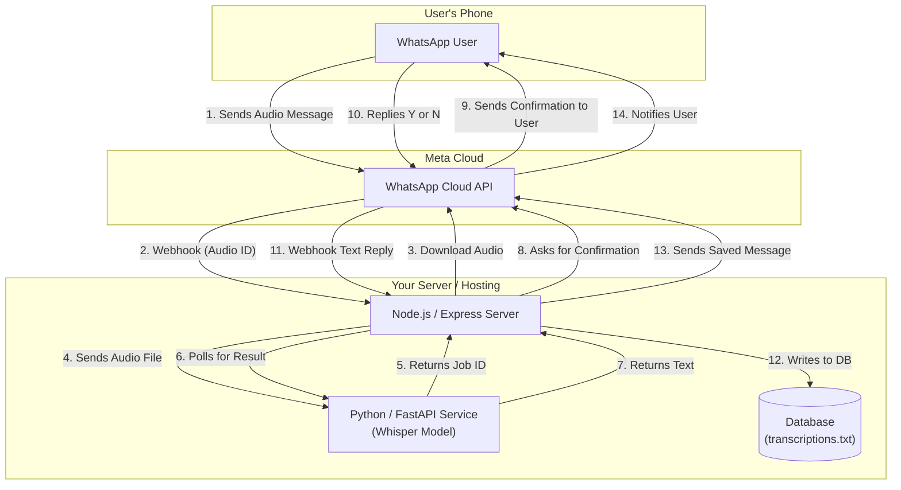
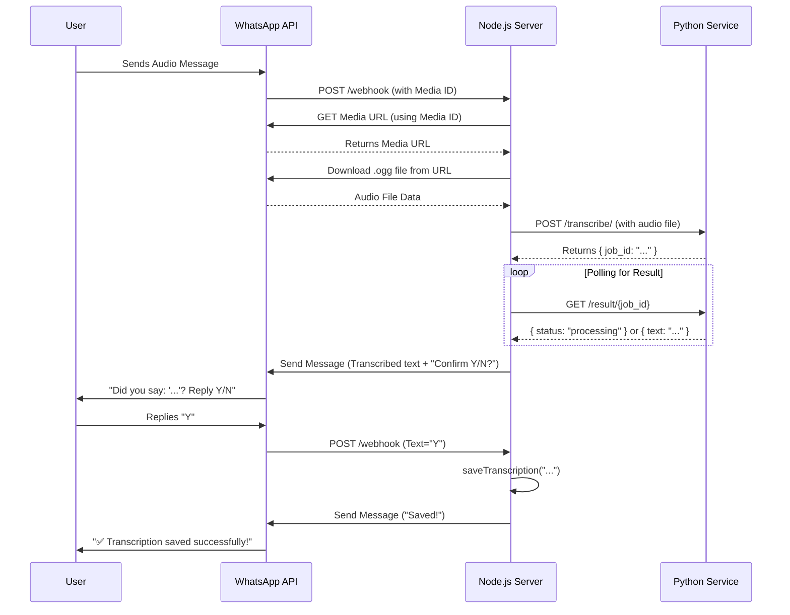

# WhatsApp Audio Transcription Bot For Personal Finance

A powerful, self-hosted personal-finance chatbot that transcribes audio messages sent via WhatsApp, confirms the transcription of the transaction with the user, and saves it to a database. The project is built with a Node.js backend to handle WhatsApp communication and a separate Python service to run the OpenAI Whisper model for high-accuracy, asynchronous transcription.

---

## Table of Contents
- [Overview](#overview)
- [Features](#features)
- [Architecture](#architecture)
- [Application Flow](#application-flow)
- [Project Structure](#project-structure)
- [Technical Stack](#technical-stack)
- [Configuration](#configuration)
- [Installation and Usage](#installation-and-usage)
- [Future Improvements](#future-improvements)

---

## Overview

The purpose of this tool is to provide a seamless way to convert personal finance transactions thoughts into written text directly from WhatsApp. Users can send a voice note to a dedicated WhatsApp number, and the bot will reply with the transcribed transaction text. 
After the user confirms the accuracy of the transcription by replying "Y", the text is saved for future reference. This is ideal for quick note-taking regarding personal finance transactions, capturing money transactions on the go, or creating records of day to day personal finance transcations.

---

## Features

-   **WhatsApp Integration:** Interacts directly within the WhatsApp interface, requiring no external apps.
-   **High-Quality Transcription:** Utilizes OpenAI's Whisper model for accurate speech-to-text conversion.
-   **Asynchronous Processing:** The Python transcription service handles audio processing in the background, preventing the main Node.js server from being blocked.
-   **User Confirmation Flow:** Ensures transcription accuracy by asking the user to confirm the text before saving.
-   **Persistent Storage:** Saves confirmed transcriptions to a local text file (easily extendable to a proper database).

---

## Architecture

The system is composed of two main services: a Node.js application that acts as the primary interface with the WhatsApp API, and a Python (FastAPI) service that handles the heavy lifting of audio transcription.


*High-Level System Architecture*

---

## Application Flow

The data flow is designed to be robust and provide clear feedback to the user at every step. The use of a job ID and polling allows the system to handle potentially long-running transcriptions without timing out.


*Detailed Sequence Diagram*

---

## Project Structure

The project consists of two separate services that should be run concurrently.

```
/
├── temp_audio/         # Temporarily stores downloaded audio (folder will be initalized once the app is started)
├── .env                # Environment variables and secrets
├── .gitignore          # Specifies files for Git to ignore
├── index.js            # Main Node.js application logic
├── package.json        # Node.js project manifest and dependencies
│── transcriptions.txt  # Simple database file for saved texts
└── python-transcribe-service/
    ├── .venv/              # Python virtual environment
    ├── whisper_api.py      # FastAPI server and Whisper logic
    └── requirements.txt    # Python dependencies
```

---

## Technical Stack

* **Backend (WhatsApp Interface):** Node.js, Express.js
* **Transcription Service:** Python, FastAPI
* **Speech-to-Text Model:** OpenAI Whisper
* **API Platform:** Meta WhatsApp Cloud API
* **Process Management:** `dotenv` for environment variables

---

## Configuration

Node.js service require a configuration file with secrets and settings.

### Node.js Service Environmental Variables (`/.env`)

Create a `.env` file in the root of the directory and add the following variables:

```
# Meta / WhatsApp Business API credentials
WHATSAPP_TOKEN=your_permanent_whatsapp_token
WHATSAPP_PHONE_NUMBER_ID=your_whatsapp_phone_number_id
VERIFY_TOKEN=make_up_any_strong_random_string
APP_SECRET=your_meta_app_secret

# URL of your running Python transcription service
TRANSCRIPTION_SERVICE_URL=your_python_transcription_service_api_url

# Server Port
PORT=3000
```

---

## Installation and Usage

Follow these steps to get the project running locally.

### 1. Setup the Python Transcription Service

```bash
# Navigate to the Python service directory
cd python-transcribe-service

# Create and activate a virtual environment
python -m venv .venv
source .venv/bin/activate  # On Windows use: .venv\Scripts\activate

# Install dependencies (including PyTorch and OpenAI-Whisper)
pip install -r requirements.txt

# Run the FastAPI server
uvicorn main:app --reload
```
The Python service will now be running, typically on `http://localhost:8000`.

### 2. Setup the Node.js Service

```bash
# Navigate to the root of the directory

# Install dependencies
npm install

# Create and populate the .env file as described in the Configuration section
```

### 3. Expose Your Local Server with ngrok

Since the WhatsApp API needs a public URL to send webhooks to, you must expose your local Node.js server to the internet.

```bash
# In a new terminal, run ngrok to forward to your Node.js port
ngrok http 3000
```
`ngrok` will provide a public HTTPS URL (e.g., `https://your-ngrok-id.ngrok.io`). Copy this URL.

### 4. Configure the Meta App Webhook

1.  Go to your App's dashboard on the Meta for Developers portal.
2.  Navigate to **WhatsApp -> API Setup**.
3.  Under the "Webhook" section, click **Edit**.
4.  Set the **Callback URL** to your ngrok URL, adding `/webhook` at the end (e.g., `https://your-ngrok-id.ngrok.io/webhook`).
5.  Set the **Verify token** to the exact `VERIFY_TOKEN` string from your `.env` file.
6.  Click **Verify and save**.
7.  After verifying, click **Manage** and subscribe to the `messages` webhook field.

### 5. Run the Application

```bash
# Start the Node.js server
node index.js
```
Your terminal should now show `Server is listening on port 3000`. Your bot is now live! Send an audio message to your test number on WhatsApp to try it out.

---

## Future Improvements

-   **Database Integration:** Replace the `transcriptions.txt` file with a proper database like PostgreSQL, MongoDB, or a cloud-based solution like Firebase Firestore for more robust and scalable storage.
-   **Error Handling:** Implement more granular error handling and send user-friendly error messages on WhatsApp when a specific part of the process fails (e.g., transcription service is down).
-   **Whitelist Authentication:** A simple and secure phone number whitelist restricts bot access to authorized users.
-   **Interactive Onboarding:** Instead of a static whitelist, create a flow where a new user can request access by providing a secret code, which then adds them to the authorized list.
-   **Containerization:** Use Docker and Docker Compose to containerize both the Node.js and Python services for easier setup, deployment, and scalability.
